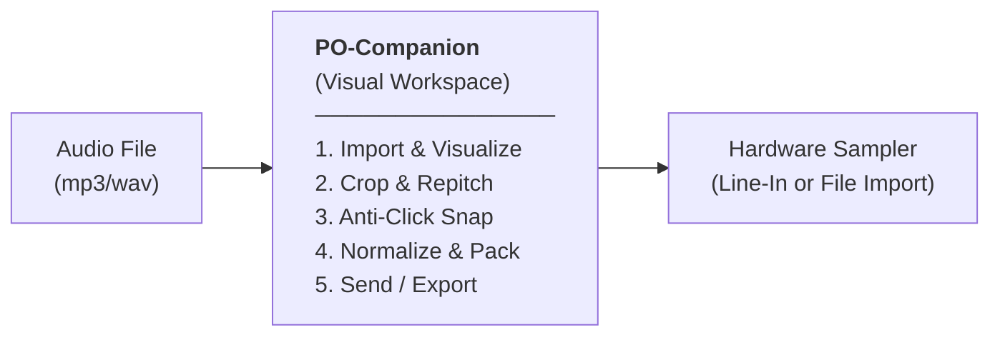

# 🎛️ PO-Companion

> **Web-based Audio Slicer & Sample-Prep Workstation**  
> *Optimized for the Teenage Engineering PO-33 KO! and general-purpose hardware samplers.*

---

<div align="center">

[](https://vuejs.org/)
[](https://www.typescriptlang.org/)
[](https://vite.dev/)
[](https://tailwindcss.com/)
[](https://deepscan.io/dashboard#view=project&tid=30173&pid=32051&bid=1042046)
[](#-copyright-and-license)
[](#-roadmap--phases)

</div>

---

## 📖 Overview

**PO-Companion** is a high-precision, mobile-friendly audio preparation and slicing workstation. Originally designed to solve the unpredictable auto-chopping and tight memory constraints of the **Teenage Engineering PO-33 KO!**, it functions as a visual, client-side audio preparation tool that formats, optimizes, and packs samples for any hardware or software sampler.

By running entirely in the browser (leveraging the Web Audio API and IndexedDB for local persistence), it offers instant sample preparation with zero server latency, zero data collection, and a fully offline-capable architecture.



---

## ⚡ Key Features

### 🎹 Universal Audio Slicing Engine
* **Sub-Millisecond Precision**: Zoom and pan into waveforms on mobile and desktop for pixel-perfect start/end marker placements.
* **Anti-Click Protection**: 
  * *Zero-Crossing Snap*: Automatically snaps markers to the nearest zero-crossing point of the waveform to avoid transients mismatch.
  * *Micro-Fade Out*: Applies a 2ms linear fade-out at the end of each slice to ensure smooth transitions and eliminate pop sounds.
* **Smart Peak Normalization**: Automatically normalizes audio to `0dBFS` or `-0.3dBFS` to maximize headroom and optimize input levels.
* **Linear Repitch & Speed Shifting**: Shift pitch/speed (from -12 to +12 semitones) using high-quality linear resampling to compress long samples and fit them into restrictive memory budgets.

### 🎛️ Pocket Operator (PO-33 KO!) Integration
* **Silence Gap Packing**: Inserts configurable digital silence gaps (`0.0` PCM) between chops. When recorded in Drum Mode, this forces the PO-33's auto-chop algorithm to slice exactly where the gaps are.
* **Memory Budget Tracker**: Visualizes in real-time how much of the PO-33's ~40-second memory budget is being consumed, factoring in pre-roll, gap sizes, and active repitching.
* **PO-33 Sync Protocol**: Optionally generates a hardware click-track sync signal on the Left channel while routing the sample stream to the Right channel (L=Sync / R=Audio split).

### 💾 Session & Project Management
* **Zero-Cloud Privacy**: All files and presets are stored locally on your device via **IndexedDB**—no audio is ever uploaded to a server.
* **Preset Manager**: Save customized project slots, recall factory presets, or export/import your setups as `.json` project files.

---

## 🚀 Getting Started

### Prerequisites
Make sure you have [Node.js](https://nodejs.org/) installed.

### Installation

1. Clone the repository:
   ```bash
   git clone https://github.com/omwcoding/PO-Companion.git
   cd PO-Companion
   ```

2. Install dependencies:
   ```bash
   npm install
   ```

3. Run the local development server:
   ```bash
   npm run dev
   ```
   Open `http://localhost:5173` in your browser.

4. Build for production:
   ```bash
   npm run build
   ```

---

## 📂 Project Structure

* `src/App.vue`: Main application UI and orchestration.
* `src/composables/useAudioEngine.ts`: Manages Web Audio API context, buffer previews, and audio state.
* `src/services/`:
  * [db.ts](file:///c:/Users/Omar/Desktop/PO-Companion/src/services/db.ts) — Native IndexedDB client wrapper for storing workspace, audio files, and presets.
  * [audioDecoder.ts](file:///c:/Users/Omar/Desktop/PO-Companion/src/services/audioDecoder.ts) — Decodes and downmixes files to 44.1kHz mono.
  * [audioNormalizer.ts](file:///c:/Users/Omar/Desktop/PO-Companion/src/services/audioNormalizer.ts) — Peak normalization algorithms.
  * [pitchShifter.ts](file:///c:/Users/Omar/Desktop/PO-Companion/src/services/pitchShifter.ts) — Pitch/Speed shifting via linear resampling.
  * [projectSnapshot.ts](file:///c:/Users/Omar/Desktop/PO-Companion/src/services/projectSnapshot.ts) — Serializes state to JSON snapshots (Base64 audio).
  * [pcmConcatenator.ts](file:///c:/Users/Omar/Desktop/PO-Companion/src/services/pcmConcatenator.ts) — Handles slot splitting, micro-fades, zero-crossing, and silence gaps.
  * [wavEncoder.ts](file:///c:/Users/Omar/Desktop/PO-Companion/src/services/wavEncoder.ts) — Encodes raw float PCM to exportable WAV files.
* `src/stores/useSampleStore.ts`: Pinia store for app-wide reactive state.
* `docs/TECHNICAL.md`: Full architectural specification and hardware research details.

---

## 🗺️ Roadmap & Commercial Vision

The application is structured to evolve from a PO-33 utility to a comprehensive standalone companion app:

*   **Phase 1-4: Core Engine, Visual Chopper, & Presets** 🏃 *In Progress*
    *   Visual multi-pad editor, Zero-crossing snap, micro-fades, repitching, IndexedDB saving, and custom PO-33 sync engine.
*   **Phase 5: Offline PWA & Layout Reskin** ➡️ *Next*
    *   Full PWA service-worker registration for 100% offline mobile/desktop usage.
    *   Refined desktop-responsive layout.
*   **Phase 6: Universal Sampler & Export Options** 📅 *Planned*
    *   **ZIP Export**: Download all selected pads as a ZIP file containing individual, normalized WAV files (perfect for EP-133, SP-404, or DAWs).
    *   **Universal Grids**: Custom grid sizes (e.g. 1x8, 2x8, 4x4) and target-device export presets.
*   **Phase 7: Native App Compilation** 📅 *Planned*
    *   Native compilation for iOS & Android using Capacitor/Cordova.
    *   Desktop standalone build using Tauri.

---

## 📄 Copyright and License

**© 2026 Omar Balde (omwcoding). All rights reserved.**

The source code of this project is made public strictly for portfolio and reference purposes. **No license is granted** for the use, modification, distribution, or reproduction, in whole or in part, of this code or its assets without explicit written permission from the author.

---

## ⚖️ Trademark Disclaimer

*PO-Companion is an independent software tool and is not affiliated, associated, authorized, endorsed by, or in any way officially connected with Teenage Engineering AB, Korg Inc., or any of their subsidiaries or affiliates. "Teenage Engineering", "Pocket Operator", "PO-33 KO!", "EP-133 KO II", and related brand names are registered trademarks of their respective owners. The use of these names in this project is strictly for interoperability demonstration and compatibility reference purposes.*

---

## 💬 Feedback & Inquiries

Since this project is currently proprietary and under active commercial development, I am not accepting public code contributions or Pull Requests. 

However, bug reports, feature suggestions, or business inquiries are highly welcome! Feel free to open an **Issue** or reach out directly.