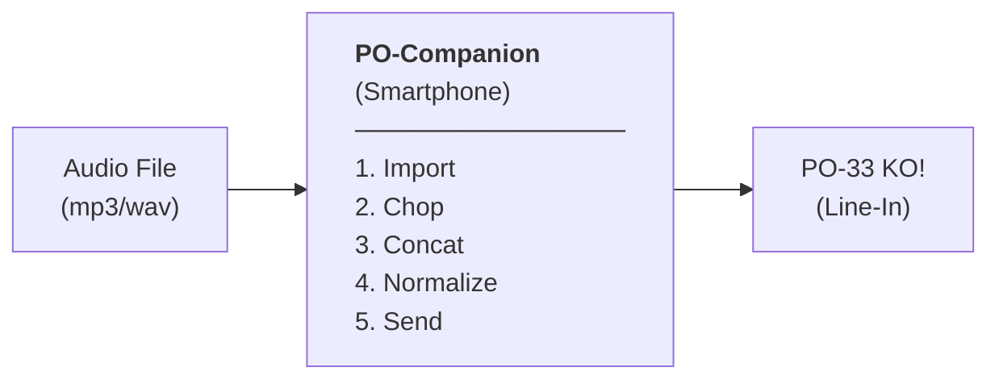

# 🎛️ PO-Companion

> **Mobile-first utility for visual chopping of audio samples destined for the Teenage Engineering PO-33 KO!**

---

<a href="https://deepscan.io/dashboard#view=project&tid=30173&pid=32051&bid=1042046"></a>

## 📖 Overview

**PO-Companion** is a companion web application designed to streamline the sample preparation workflow for the **Teenage Engineering PO-33 KO!** pocket sampler. 

It solves the unpredictability of the PO-33 KO!'s built-in transient-based auto-chop algorithm by allowing users to prepare, chop, normalize, and concatenate samples directly on their mobile device or computer before transmitting them as a single, perfectly timed audio stream.



---

## 🛠️ The Problem & The Solution

### The Problem
* The PO-33 KO! has a limited memory of **~40 seconds** total, shared across all slots.
* The automatic chopping (auto-chop) algorithm in **Drum Mode** is unpredictable, unconfigurable, and prone to error.
* Incorrect chops require deleting the sample and repeating the entire analog recording process.
* Trimming samples inside the PO-33 does not reclaim memory—the device keeps the full recording.

### The Solution: The "Silence Gap" Trick
PO-Companion lets you load an audio file, visually define start/end markers for up to 16 pads, and automatically concatenates them into a single audio file with precise **digital silence gaps** (defaulting to 20ms) between them. 

When the PO-33 KO! records this stream in Drum Mode, it detects the transition from silence to sound and places the slice markers exactly where they belong.

#### ⚡ Key Features
* **Silence Gap Insertion**: Inserts configurable digital silence gaps (`0.0` PCM) to force precise PO-33 auto-chops.
* **Anti-Click Protection**: 
  * *Micro-Fade Out*: Applies a 2ms linear fade-out at the end of each slice to avoid clicking.
  * *Zero-Crossing Snap*: Automatically snaps markers to the nearest zero-crossing point of the waveform.
* **Smart Peak Normalization**: Automatically normalizes audio to 0dBFS or -0.3dBFS to ensure the best recording level for the PO-33 ADC.
* **Memory Budget Tracker**: Visualizes how much of the PO-33's ~40-second memory budget is being consumed by your current setup (including pre-roll and silence gaps) taking pitch/resampling speed into account.
* **Pitch Shifting (Speed/Resampling)**: Shift pitch/speed (from -12 to +12 semitoni) to fit longer sounds into the 40s memory budget.
* **Local Persistence (IndexedDB)**: Auto-saves workspace slots and files to IndexedDB, keeping work safe on reload.
* **Preset Manager**: Save projects locally in IndexedDB, load Factory presets from the server, or import/export JSON files.

---

## 🚀 Getting Started

### Prerequisites
Make sure you have [Node.js](https://nodejs.org/) installed.

### Installation

1. Clone the repository:
   ```bash
   git clone https://github.com/omwcoding/PO-Companion.git
   cd PO-Companion
   ```

2. Install dependencies:
   ```bash
   npm install
   ```

3. Run the local development server:
   ```bash
   npm run dev
   ```
   Open `http://localhost:5173` in your browser.

4. Build for production:
   ```bash
   npm run build
   ```

---

## 📂 Project Structure

* `src/App.vue`: Main application entry point and user interface.
* `src/composables/useAudioEngine.ts`: Manages the Web Audio API context, loading files, and playing/stopping preview buffers.
* `src/services/`:
  * [db.ts](file:///c:/Users/Omar/Desktop/PO-Companion/src/services/db.ts) — Native IndexedDB client wrapper for audio files, project states and user presets.
  * [audioDecoder.ts](file:///c:/Users/Omar/Desktop/PO-Companion/src/services/audioDecoder.ts) — Decodes and resamples audio files (resampling to 44.1kHz mono).
  * [audioNormalizer.ts](file:///c:/Users/Omar/Desktop/PO-Companion/src/services/audioNormalizer.ts) — Applies peak normalization.
  * [pitchShifter.ts](file:///c:/Users/Omar/Desktop/PO-Companion/src/services/pitchShifter.ts) — Performs linear resampling to repitch PCM arrays.
  * [projectSnapshot.ts](file:///c:/Users/Omar/Desktop/PO-Companion/src/services/projectSnapshot.ts) — Serializes workspace state into self-contained JSON snapshots (Base64 audio).
  * [pcmConcatenator.ts](file:///c:/Users/Omar/Desktop/PO-Companion/src/services/pcmConcatenator.ts) — Handles slot chopping, micro-fades, zero-crossing detection, and silence gap concatenation.
  * [wavEncoder.ts](file:///c:/Users/Omar/Desktop/PO-Companion/src/services/wavEncoder.ts) — Encodes Float32 PCM arrays into exportable WAV files.
* `src/stores/useSampleStore.ts`: Pinia store containing active samples, slot configurations, preset IDs and application settings.
* `docs/TECHNICAL.md`: Full technical specifications and architecture details.

---

## 🗺️ Roadmap & Phases

The development of PO-Companion is structured in several phases:

*   **Phase 1: Audio Engine Core** ✅
    *   [x] File uploading, decoding, and resampling.
    *   [x] Digital silence gap insertion.
    *   [x] Anti-click (Zero-crossing & micro-fades).
    *   [x] Peak normalization.
    *   [x] WAV Export and basic debug UI.
*   **Phase 2: Mobile-First Visual Chopper** ✅
    *   [x] Interactive waveform rendering (WaveformOverview + WaveformDetail with OffscreenCanvas).
    *   [x] Touch-friendly drag-and-drop slice markers (pinch, pan, long-press).
    *   [x] Pad-by-pad preview playback (Web Audio API).
    *   [x] 4×4 PadGrid with visual states (empty, assigned, selected, playing).
    *   [x] BudgetMeter — real-time 40s memory tracker with per-pad breakdown.
    *   [x] Pinia state management integration.
*   **Phase 3: UI Polish & Power Tools** ✅
    *   [x] Phosphor/CRT theme (green-on-black retro terminal aesthetic).
    *   [x] PO-33 Sync Protocol (L=clock / R=audio split).
    *   [x] Multi-source sample loading.
*   **Phase 4: Persistence, Pitch Shifting & Presets** ✅
    *   [x] Local database persistence (IndexedDB).
    *   [x] Repitch per-pad (pitch shifting to save memory budget).
    *   [x] Project Snapshots (Save/Recall slots and audio in JSON).
    *   [x] Quick-Access Preset strip (dropdown, quick-save, save-as, quick-delete).
    *   [x] Factory Sound Presets (pre-packaged banks loaded from `/presets/`).
*   **Phase 5: Offline PWA & Reskin** *(Next)*
    *   [ ] Redesign visual interfaces.
    *   [ ] PWA installation support for full offline usage.
*   **Phase 6: Native App**
    *   [ ] Compilation for iOS & Android using Capacitor.

---

## 🤝 Contributing

Contributions are welcome! Please check out [docs/TECHNICAL.md](file:///c:/Users/Omar/Desktop/PO-Companion/docs/TECHNICAL.md) for detailed guidelines, constraints, and architecture explanations.

For UI/UX design decisions and competitive landscape analysis, see [§10 — Analisi Competitiva](docs/TECHNICAL.md#10-analisi-competitiva-e-riferimenti-ui).

## 📄 Copyright and License

**© 2026 Omar Balde (omwcoding). All rights reserved.**

The source code of this project is made public strictly for portfolio and reference purposes. **No license is granted** for the use, modification, distribution, or reproduction, in whole or in part, of this code or its assets without explicit written permission from the author.
