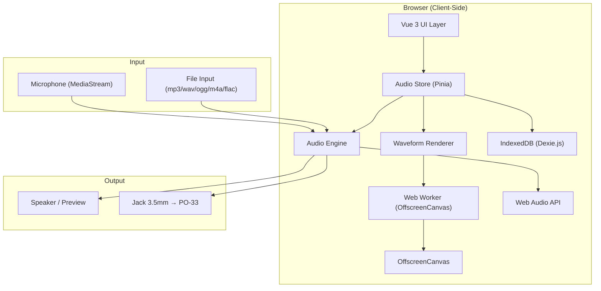
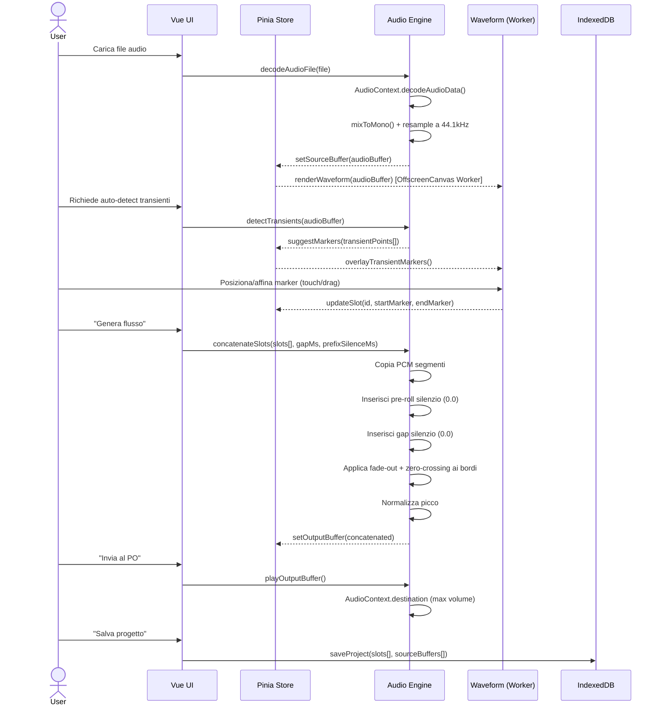

# PO-Companion — Documentazione Tecnica Completa

> *Utility mobile-first per il chopping visuale dei campioni audio destinati al Teenage Engineering PO-33 KO!*

---

## 1. Visione del Prodotto

### 1.1 Il Problema

Il **Teenage Engineering PO-33 KO!** è un campionatore hardware tascabile con un'interfaccia volutamente minimale: un display monocromatico da 1", nessun controllo visuale sulla forma d'onda e un ingresso audio analogico Line-In da 3.5mm come unico metodo di importazione dei campioni.

Quando si registra un campione lungo in uno slot **Drum**, il PO-33 esegue un **auto-chop** basato sulla rilevazione dei transienti (picchi di volume). Il problema è che:

- L'algoritmo di taglio è **imprevedibile** e non configurabile dall'utente.
- Non c'è **anteprima visuale** dell'audio prima o dopo il taglio.
- I tagli errati costringono a **ripetere l'intero processo** di registrazione.
- Il budget di memoria è limitato a **~40 secondi totali** condivisi tra tutti gli slot.

### 1.2 La Soluzione

**PO-Companion** sposta l'intera fase di preparazione dei campioni sullo smartphone:

```
┌─────────────┐     ┌──────────────────┐     ┌─────────────┐
│  Audio File  │────▶│   PO-Companion   │────▶│   PO-33 KO! │
│  (mp3/wav)   │     │  (Smartphone)    │     │  (Line-In)   │
└─────────────┘     └──────────────────┘     └─────────────┘
                          │
                    ┌─────┴──────┐
                    │ 1. Import  │
                    │ 2. Visualize│
                    │ 3. Chop    │
                    │ 4. Concat  │
                    │ 5. Send    │
                    └────────────┘
```

L'utente carica un file audio, lo taglia visualmente in segmenti (max 16 pad), e l'app genera un **flusso audio unico e continuo** con gap di silenzio calibrati che forzano il PO-33 a eseguire l'auto-chop esattamente nei punti desiderati.

### 1.3 Target User

- Musicisti e beatmaker che usano il PO-33 KO! dal vivo o in studio.
- Utenti con conoscenza base del sampling ma frustrati dal workflow hardware.
- Community Pocket Operator (Reddit r/pocketoperators, forum TE).

---

## 2. Contesto Hardware — PO-33 KO!

### 2.1 Specifiche Rilevanti

| Parametro | Valore |
|---|---|
| Memoria totale campioni | **~40 secondi** (pool unico condiviso da tutti gli slot) |
| Slot Drum | 16 (griglia 4x4, bank A) |
| Slot Melodic | 16 (griglia 4x4, con pitch tracking, bank B) |
| Sample Rate **interno** del PO-33 | **~23.437 Hz** *(non 44.1kHz — vedi §2.6)* |
| Bit Depth interno | **8-bit µ-law** *(companding — vedi §2.6)* |
| Sample Rate **output** app → line-in | **44.1 kHz** (la ADC del PO-33 converte internamente) |
| Canali | **Mono** (l'input stereo viene mixato internamente) |
| Ingresso audio | Jack 3.5mm TRS (Line-In) |
| Metodo di taglio Drum | Auto-chop su transienti (inaffidabile) **oppure** 16 parti uguali via melodic copy trick |
| Il trim salva memoria? | **No** — il PO-33 conserva l'intera registrazione originale |
| Formato sync | SY-sync su canale Left *(frequenza esatta da verificare — vedi §2.4)* |

### 2.2 Il Trucco del Silenzio (Silence Gap)

Questo è il **cuore tecnico** dell'intera applicazione.

Il PO-33, quando registra in modalità Drum, analizza il flusso audio in ingresso e genera tagli automatici dove rileva una **transizione da silenzio a suono** (transiente). Sfruttando questo comportamento, possiamo:

1. **Tagliare** un file audio in N segmenti (1 ≤ N ≤ 16).
2. **Inserire un gap di silenzio digitale** tra ogni segmento.
3. **Concatenare** il tutto in un unico flusso continuo.
4. **Inviare** il flusso al PO-33, che taglierà esattamente nei punti dei gap.

```
Flusso audio generato dall'app:

[___]│▓▓▓▓▓▓▓│___│▓▓▓▓│___│▓▓▓▓▓▓▓▓▓▓│___│▓▓▓│
Pre-roll  Pad 1  Gap  Pad2  Gap    Pad 3     Gap Pad4
 50ms           20ms       20ms              20ms
```

> [!IMPORTANT]
> Il gap deve essere **silenzio digitale puro**: valore PCM = `0.0` su ogni campione del gap.
> Qualsiasi rumore residuo (anche -60dB) può causare un taglio mancato.

#### Parametri del Gap

| Parametro | Default | Range | Note |
|---|---|---|---|
| **Pre-roll silence** | **50ms** | 20–500ms | Silenzio iniziale prima del primo pad, per "armare" il PO-33 |
| Durata gap | **20ms** | 10–200ms | Configurabile dall'utente |
| Valore PCM | `0.0` | Fisso | Silenzio digitale assoluto |
| Campioni a 44.1kHz | **882** | 441–8820 | `durata_ms × 44.1` |

> [!WARNING]
> Ogni gap consuma budget di memoria. Con 16 pad e gap 20ms:
> `15 gap × 20ms = 300ms` + pre-roll 50ms = ~350ms totali sprecati. Con gap 100ms: `15 × 100ms = 1.5s` persi.

#### Protezione Anti-Click (Zero-Crossing)

> [!CAUTION]
> **Edge case critico**: Se un segmento audio viene tagliato a metà di una forma d'onda (es. ampiezza a `0.5`) e si passa istantaneamente a `0.0` (gap di silenzio), si genera un **gradino d'onda netto** (discontinuità). Questo gradino produce un "pop" o "click" ad alta frequenza che il PO-33 può rilevare come **falso transiente**, sballando completamente l'auto-chop.

Per prevenire questo problema, l'algoritmo di estrazione deve applicare **due strategie combinate**:

**Strategia 1 — Micro-Fade (sempre attiva):**
```
Applica un fade-out lineare di 2ms (88 campioni a 44.1kHz)
sugli ultimi campioni del segmento, prima del gap di silenzio.

Per i = 0 → fadeSamples:
  sample[endSample - fadeSamples + i] *= (1.0 - i / fadeSamples)
```

**Strategia 2 — Zero-Crossing Snap (opzionale, consigliata):**
```
Dopo aver calcolato endSample dal marker dell'utente,
cerca il punto di zero-crossing più vicino (dove il segnale
attraversa lo zero) entro una finestra di ±2ms.

zc = findNearestZeroCrossing(buffer, endSample, windowSamples=88)
Se trovato: endSample = zc
```

| Strategia | Pro | Contro |
|---|---|---|
| Micro-Fade | Sempre efficace, nessun artefatto | Taglia ~2ms dal campione |
| Zero-Crossing Snap | Taglio perfettamente pulito | Sposta leggermente il punto di taglio |
| **Entrambe** | **Massima affidabilità** | Complessità minima, miglior risultato |

> [!CAUTION]
> **Il fade-in all'inizio del segmento va applicato SOLO nell'anteprima interna**, non nel flusso di output verso il PO-33.
> Il PO-33 rileva il **transiente** in ingresso per fare il chop: un fade-in rende l'attacco morbido e il dispositivo potrebbe **non rilevare il taglio** o tagliare in ritardo. Vedi §5.7 per i dettagli implementativi.

### 2.3 Comunicazione Audio Smartphone → PO-33

La comunicazione è **unidirezionale e analogica**:

```
Smartphone (3.5mm out) ──cable──▶ PO-33 (3.5mm Line-In)
```

**Requisiti critici:**

- Il **volume di output** deve essere il massimo possibile senza clipping/distorsione.
- L'audio deve essere **normalizzato** al picco (peak normalization a 0dBFS o -0.3dBFS per margine).
- Il PO-33 mixa l'input stereo a mono internamente.

#### Modalità di Output Audio

| Modalità | Canale Left | Canale Right | Quando |
|---|---|---|---|
| **Dual Mono** (default) | Audio campioni | Audio campioni | Sync OFF — Fasi 1-2 |
| **Stereo Sync** | Clock sync | Audio campioni | Sync ON — Fase 3 |

> [!IMPORTANT]
> **Dual Mono è il default obbligatorio.** Se l'audio fosse inviato solo sul canale Right, l'utente che usa le cuffie per monitorare il trasferimento sentirebbe il suono solo da un orecchio — esperienza pessima. Il PO-33 accetta tranquillamente il segnale identico su entrambi i canali e lo somma internamente. Lo split L=sync / R=audio va attivato **esclusivamente** quando l'opzione Sync è flaggata dall'utente.

### 2.4 Sync Protocol (Fase 3)

> [!WARNING]
> **La frequenza esatta del segnale SY-sync è da verificare empiricamente o tramite ricerca nella community TE/r/pocketoperators.** La tabella §2.1 riportava "~15kHz" che potrebbe essere errato (possibile confusione con il formato Korg Volca). Fonti della community indicano un'onda quadra nell'ordine di **~1kHz**, ma il duty cycle e l'ampiezza esatta richiedono reverse engineering o documentazione ufficiale non pubblica. Questa sezione verrà completata nella Fase 3.

Il protocollo SY-sync dei Pocket Operator utilizza il canale Left per trasmettere un segnale di clock:

```
Canale LEFT:  ┌─┐   ┌─┐   ┌─┐   ┌─┐    ← Click di sync (impulsi)
              │ │   │ │   │ │   │ │
           ───┘ └───┘ └───┘ └───┘ └───

Canale RIGHT: ▓▓▓▓▓▓▓▓▓▓▓▓▓▓▓▓▓▓▓▓▓▓  ← Flusso audio campioni
```

Questo consente al PO-33 di:
- Registrare solo dal canale destro (audio).
- Sincronizzarsi con altri dispositivi tramite il canale sinistro (clock).

> [!NOTE]
> L'implementazione prevista è un `OscillatorNode` (onda quadra) a BPM configurabile dall'utente. Il segnale sync verrà generato nel modulo `syncGenerator.ts`. Nella Fase 3 approfondiremo il formato esatto (frequenza, duty cycle, ampiezza) con test fisici sul dispositivo.

### 2.5 Modalità Drum vs. Melodic

Il PO-33 ha due tipi di slot con comportamenti distinti in fase di registrazione:

| Caratteristica | Drum slot (bank A) | Melodic slot (bank B) |
|---|---|---|
| Auto-chop | **Sì** — rileva transienti (inaffidabile) | **No** — registra come campione singolo |
| Pitch tracking | No | **Sì** — tutti i 16 tasti = stesso campione a pitch diversi |
| Use case tipico | Kit drum, one-shot percussivi | Loop melodici, synth, voci |
| Flusso PO-Companion | **Concatenazione multi-pad con gap** | Campione singolo (nessun gap) |
| Limite per slot | Fino a 40s (se memoria disponibile) | Idem |

> [!IMPORTANT]
> Il flusso con gap di silenzio funziona **solo in modalità Drum**. In modalità Melodic il PO-33 registra l'intero flusso come un unico campione senza tagli automatici. L'UI deve rendere chiara questa distinzione con un selettore di modalità visibile.

#### Il Melodic Copy Trick (metodo alternativo al nostro)

Esiste un metodo alternativo usato dalla community per ottenere **16 slice uguali** senza usare la transient detection:

1. Registra il sample in uno slot **Melodic**
2. Trimma il sample alla lunghezza esatta desiderata
3. Esegui: `tieni WRITE + SOUND → seleziona slot Melodic sorgente → seleziona slot Drum destinazione`
4. Il PO-33 divide il sample in **esattamente 16 parti uguali** (durata_totale / 16)

> [!NOTE]
> Il nostro approccio (gap di silenzio) è **superiore** al melodic copy trick perché:
> - Permette segmenti di **durata diversa** (non per forza uguali)
> - Permette di **selezionare hit specifici** da punti diversi di una canzone lunga
> - Non richiede passaggi manuali sul PO-33 oltre alla semplice registrazione

### 2.6 Formato Audio Interno del PO-33

> [!IMPORTANT]
> Questa è una delle scoperte più rilevanti della ricerca: il PO-33 **non registra a 44.1kHz 16-bit** come documenti TE potrebbero suggerire.

Il formato audio interno del PO-33 (confermato dalla community su sp-forums.com e elektronauts):

| Parametro | Valore |
|---|---|
| Sample rate interno | **~23.437 Hz** (non standard) |
| Bit depth interno | **8-bit con µ-law companding** |
| Qualità percepita | ~10-12 bit (grazie alla compressione µ-law) |
| Origine del suono lo-fi | Questo formato, simile a SP-1200/MPC60 vintage |

**Implicazioni per PO-Companion:**

- Il nostro **output rimane a 44.1kHz PCM** — inviamo il miglior segnale possibile all'ADC del PO-33 via line-in, che poi converte internamente a 23kHz µ-law.
- Non dobbiamo preoccuparci del formato interno: è la ADC analogica del PO-33 a fare la conversione.
- **Feature futura (Fase 3.5)**: modalità "PO-33 Sound Preview" che simula il downsample a 23kHz + encoding µ-law nell'anteprima in-app, così l'utente sente *esattamente* come suonerà il campione sul device.

### 2.7 Competitor Analysis — Overloader33

L'unico tool esistente con funzionalità simili è **Overloader33** (overloader33.com), una webapp browser-based creata dalla community:

| Funzione | Overloader33 | PO-Companion |
|---|---|---|
| Playback via line-in | ✅ | ✅ |
| Gap tra sample | ✅ (basico) | ✅ (configurabile, anti-click, pre-roll) |
| Waveform visuale interattiva | ❌ | ✅ |
| Chopping visuale con marker | ❌ | ✅ |
| Transient detection | ❌ | ✅ |
| Preview per-pad | ❌ | ✅ |
| Navigazione su file lunghi | ❌ | ✅ (overview + detail) |
| Normalizzazione automatica | ❌ | ✅ |
| Anti-click (fade + zero-crossing) | ❌ | ✅ |
| PO-33 sound preview (µ-law) | ❌ | 🔜 Fase 3.5 |
| Salvataggio progetto offline | ❌ | ✅ Fase 4 |
| PWA installabile | ❌ | ✅ Fase 4 |

---

## 3. Architettura Tecnica

### 3.1 Architettura ad Alto Livello



### 3.2 Moduli Principali

| Modulo | Responsabilità | Tecnologia |
|---|---|---|
| **AudioEngine** | Decodifica, manipolazione PCM, concatenazione, normalizzazione, playback | Web Audio API |
| **WaveformRenderer** | Rendering della forma d'onda, gestione marker di taglio, interazione touch | OffscreenCanvas + Web Worker |
| **TransientDetector** | Rilevazione automatica dei transienti nel segnale audio per suggerire punti di taglio | Web Audio API (AnalyserNode) |
| **SampleStore** | Stato globale: slot 4x4, markers, metadata, undo history | Pinia |
| **PersistenceLayer** | Serializzazione/deserializzazione AudioBuffer, salvataggio offline | Dexie.js + IndexedDB |
| **ExportService** | Generazione del file WAV concatenato, normalizzazione, gestione sync | Web Audio API + WAV encoder |
| **UILayer** | Griglia pad, controlli, feedback visuale, modal | Vue 3 + Tailwind v4 |

### 3.3 Flusso Dati Principale



---

## 4. Modello Dati

### 4.1 Strutture Core

```typescript
// Rappresenta un singolo pad della griglia 4x4
interface SampleSlot {
  id: number              // 1-16, posizione nella griglia
  name: string            // Nome personalizzabile ("Kick", "Snare", ...)
  sourceBufferId: string  // Riferimento al buffer sorgente in IndexedDB
  // NOTA: nella v1 ogni pad può attingere a un buffer sorgente diverso.
  // L'utente può caricare più file audio nella stessa sessione; ogni
  // SampleSlot punta al proprio sourceBufferId indipendentemente.
  startMarker: number     // Punto di inizio taglio (in secondi, precisione ms)
  endMarker: number       // Punto di fine taglio (in secondi, precisione ms)
  isAssigned: boolean     // true se il pad ha un campione assegnato
  volume: number          // 0.0 - 1.0, volume individuale del pad
  color: string           // Colore visuale del pad nella griglia
  reversed: boolean       // true = PCM invertito (effetto reverse)
}

// Progetto salvato
interface Project {
  id: string              // UUID
  name: string            // Nome del progetto
  createdAt: number       // Timestamp creazione
  updatedAt: number       // Timestamp ultimo aggiornamento
  slots: SampleSlot[]     // Array di 16 slot
  sourceBufferIds: string[] // Lista di tutti i buffer sorgente usati nel progetto
  settings: ProjectSettings
}

// Impostazioni del progetto
interface ProjectSettings {
  gapDurationMs: number      // Durata gap di silenzio (default: 20)
  prefixSilenceMs: number    // Silenzio pre-roll prima del primo pad (default: 50)
  sampleRate: number         // 44100 (fisso per PO-33)
  normalizationTarget: number // dBFS target (-0.3 default) → 0.97 float
  normalizationMode: 'global' | 'per-pad' // Global = tutto il flusso; per-pad = ogni segmento individualmente
  syncEnabled: boolean       // Split L/R per sync
  syncBpm: number            // BPM per il clock sync
  antiClickMode: 'fade' | 'zero-crossing' | 'both' // Protezione anti-click (default: 'both')
  fadeDurationMs: number     // Durata micro-fade (default: 2)
  slotMode: 'drum' | 'melodic' // Modalità destinazione sul PO-33
}

// Buffer audio serializzato per IndexedDB
interface StoredAudioBuffer {
  id: string              // UUID
  fileName: string        // Nome file originale
  sampleRate: number
  numberOfChannels: number
  length: number          // Numero di campioni
  channelData: Float32Array[] // Dati PCM per canale
}

// Punto transiente rilevato automaticamente
interface TransientPoint {
  timeSeconds: number     // Posizione nel buffer sorgente
  strength: number        // 0.0 - 1.0, forza del transiente
}
```

### 4.2 Schema IndexedDB (Client Nativo)

L'applicazione utilizza un client IndexedDB nativo (senza dipendenze esterne come Dexie.js) con versione database `2` per massimizzare la velocità e minimizzare il peso dell'app bundle.

#### Database: `POCompanionDB` (Version: 2)

1. **`audio_files`** (Store con `keyPath: 'id'`)
   - `id`: string (UUID generato all'upload)
   - `fileName`: string
   - `pcmData`: Float32Array (campioni audio decodificati e pronti all'uso)
   - `duration`: number
   - `sampleRate`: number

2. **`project_state`** (Store key-value semplice)
   - `slots`: array di `SampleSlot` (stato attuale dei 16 pad, inclusi markers, pitch, volume, reverse)
   - `settings`: impostazioni di normalizzazione, pre-roll e BPM sync
   - `activeSourceId`: ID del file audio attualmente visualizzato
   - `activePresetId`: ID del preset attualmente caricato
   - `activePresetName`: nome del preset attualmente caricato

3. **`user_presets`** (Store con `keyPath: 'id'`)
   - `id`: string (UUID)
   - `name`: string (nome del preset utente)
   - `createdAt`: number (timestamp millisecondi)
   - `snapshot`: snapshot di progetto autonomo serializzato con l'audio in formato Base64.

---

## 5. Algoritmi Core

### 5.1 Decodifica Audio

```
Input:  File (mp3, wav, ogg, m4a, flac)
Output: AudioBuffer (44.1kHz, mono, Float32)

Passaggi:
1. File → ArrayBuffer (FileReader.readAsArrayBuffer)
2. ArrayBuffer → AudioBuffer (AudioContext.decodeAudioData)
3. Se stereo → mix a mono: out[i] = (left[i] + right[i]) / 2
4. Se sampleRate ≠ 44100 → resample con OfflineAudioContext a 44100Hz
```

> [!WARNING]
> **Problema iOS Safari — Sample Rate fisso**: su iPhone/iPad, `AudioContext` forza il `sampleRate` del device (tipicamente **48kHz**), ignorando qualsiasi valore richiesto nel costruttore. Il resample a 44.1kHz deve essere applicato **in output** tramite `OfflineAudioContext(channels, length, 44100)` sia durante la decodifica che durante la generazione del flusso finale. Non assumere mai che `AudioContext.sampleRate === 44100`.

### 5.2 Concatenazione PCM con Gap di Silenzio

Questo è l'algoritmo più critico dell'applicazione:

```
Input:  slots[] (array di SampleSlot assegnati, ordinati per id)
        gapMs (durata gap in millisecondi)
        prefixSilenceMs (pre-roll iniziale)
        sampleRate (44100)

Output: Float32Array (flusso audio concatenato)

Algoritmo:
1. gapSamples    = Math.round(gapMs / 1000 × sampleRate)
   prefixSamples = Math.round(prefixSilenceMs / 1000 × sampleRate)
2. Per ogni slot assegnato:
   a. startSample = Math.round(slot.startMarker × sampleRate)
   b. endSample   = Math.round(slot.endMarker × sampleRate)
   c. segmentLength = endSample - startSample
3. totalLength = prefixSamples + Σ(segmentLength) + (numSlots - 1) × gapSamples
4. Verifica: totalLength / sampleRate ≤ 40.0 secondi
5. output = new Float32Array(totalLength)  // Inizializzato a 0.0
6. offset = prefixSamples  // Salta il pre-roll (già 0.0)
7. Per ogni slot (i):
   a. Applica zero-crossing snap a endSample (vedi §5.7)
   b. Applica micro-fade OUT sugli ultimi fadeSamples del segmento (vedi §5.7)
   c. Se slot.reversed → inverti i campioni del segmento prima di copiare
   d. Copia PCM: output.set(segment, offset)
   e. offset += segmentLength
   f. Se non è l'ultimo slot:
      offset += gapSamples  // I valori sono già 0.0 (silenzio)
8. Normalizza output secondo normalizationMode (vedi §5.3)
9. Return output
```

> [!CAUTION]
> `Float32Array` è inizializzato a `0.0` per specifica ECMAScript. Non serve azzerare manualmente il pre-roll o i gap.
> Tuttavia, è buona pratica verificare con un assert in fase di debug.

> [!NOTE]
> **Fade-in NON applicato nel flusso di output.** Il PO-33 rileva l'attacco del transiente per eseguire il chop: un fade-in renderebbe l'inizio morbido e potrebbe causare rilevazione mancata o ritardata. Il fade-in è applicato **esclusivamente** nel player di anteprima interno (vedi §5.7).

### 5.3 Normalizzazione Audio (Peak Normalization)

```
Input:  Float32Array (audio PCM)
        targetPeak (default: 0.97, ovvero ~-0.3dBFS)
        mode: 'global' | 'per-pad'

Output: Float32Array normalizzato

Algoritmo (mode = 'global'):
1. Trova il picco assoluto: peak = max(|sample[i]|) per ogni i
2. Se peak == 0 → return (silenzio totale)
3. gain = targetPeak / peak
4. Per ogni campione: sample[i] *= gain

Algoritmo (mode = 'per-pad'):
1. Per ogni segmento individuale:
   a. Trova il picco del solo segmento
   b. Calcola gain individuale = targetPeak / peak
   c. Applica gain solo ai campioni di quel segmento
2. Utile per kit eterogenei (es. kick molto forte + hi-hat debole)
```

### 5.4 Codifica WAV (Export)

Per esportare il flusso concatenato come file `.wav`:

```
Formato: RIFF/WAVE
- Sample Rate: 44100 Hz
- Bit Depth: 16-bit (conversione da Float32)
- Canali: 1 (mono) o 2 (stereo con sync)
- Encoding: PCM lineare (little-endian)

Conversione Float32 → Int16:
  int16[i] = Math.max(-32768, Math.min(32767, Math.round(float32[i] × 32767)))
```

### 5.5 Pitch Shifting dei Pad (Resampling Lineare)

Per velocizzare (risparmiando secondi di memoria) o rallentare i campioni per singolo pad, l'applicazione applica un algoritmo di resampling ad interpolazione lineare.

```
Input:  pcmData (Float32Array)
        pitch (semitoni da -12 a +12)
        sampleRate (44100)

Output: Float32Array ri-campionato

Algoritmo:
1. Calcola il fattore di resampling (velocità):
   factor = Math.pow(2, pitch / 12)  // es. +12 semitoni raddoppia la velocità (factor = 2.0)
2. Calcola la nuova lunghezza del segmento:
   newLength = Math.floor(pcmData.length / factor)
3. Inizializza il nuovo array di output:
   output = new Float32Array(newLength)
4. Per ogni indice i dell'output (0 → newLength - 1):
   a. Trova la posizione originale corrispondente:
      origPos = i × factor
   b. Calcola gli indici interi adiacenti:
      indexA = Math.floor(origPos)
      indexB = Math.min(indexA + 1, pcmData.length - 1)
   c. Calcola la frazione (peso dell'interpolazione):
      weight = origPos - indexA
   d. Applica interpolazione lineare:
      output[i] = pcmData[indexA] × (1.0 - weight) + pcmData[indexB] × weight
5. Return output
```

### 5.6 Rendering Waveform (OffscreenCanvas + Web Worker)

```
Input:  AudioBuffer, canvasWidth, canvasHeight
Output: Rendering su OffscreenCanvas (via Web Worker)

Algoritmo (downsampling per performance):
1. Worker riceve Float32Array e dimensioni canvas via postMessage (transferable)
2. samplesPerPixel = buffer.length / canvasWidth
3. Per ogni pixel x (0 → canvasWidth):
   a. start = Math.floor(x × samplesPerPixel)
   b. end   = Math.floor((x + 1) × samplesPerPixel)
   c. Trova min e max nel range [start, end]
   d. Disegna linea verticale da min a max (centrata)
4. Overlay: marker di taglio (linee verticali draggabili)
5. Overlay: regioni colorate per ogni pad assegnato
6. Overlay: punti transienti rilevati (diamanti o triangoli, colore secondario)
7. Overlay: cursore di riproduzione animato
```

> [!NOTE]
> Usare **OffscreenCanvas** trasferito a un Web Worker è fondamentale per dispositivi Android economici. Mantiene il thread UI libero durante il rendering della waveform di file audio lunghi, garantendo ≥60fps nell'interazione touch.

### 5.7 Protezione Anti-Click (Micro-Fade + Zero-Crossing)

Applicato durante la concatenazione (§5.2) per prevenire click/pop ai bordi dei segmenti.

```
Input:  Float32Array (segmento audio), fadeDurationMs (default: 2)
        mode: 'fade' | 'zero-crossing' | 'both'
        context: 'output' | 'preview'  ← CRITICO: determina se applicare fade-in

Algoritmo (applicato al flusso di OUTPUT):

--- Fase A: Zero-Crossing Snap (se mode = 'zero-crossing' o 'both') ---
1. windowSamples = Math.round(fadeDurationMs / 1000 × sampleRate)  // ~88 a 44.1kHz
2. Per i da endSample verso (endSample - windowSamples):
   a. Se sign(sample[i]) ≠ sign(sample[i-1]):  // attraversamento dello zero
      endSample = i
      break
3. Se nessun zero-crossing trovato → fallback a Fase B

--- Fase B: Micro-Fade OUT Lineare (se mode = 'fade' o 'both') ---
4. fadeSamples = Math.round(fadeDurationMs / 1000 × sampleRate)
5. Per i = 0 → fadeSamples:
   a. gain = 1.0 - (i / fadeSamples)   // rampa lineare 1.0 → 0.0
   b. sample[endSample - fadeSamples + i] *= gain

--- Fade-IN (SOLO se context = 'preview') ---
6. Se context === 'preview':
   Per i = 0 → fadeSamples:
     a. gain = i / fadeSamples          // rampa lineare 0.0 → 1.0
     b. sample[startSample + i] *= gain
```

> [!CAUTION]
> Il **fade-in sul `startSample` NON va mai applicato al flusso di output**. Il PO-33 rileva il transiente in ingresso per eseguire il chop: ammorbidire l'attacco causa rilevazione mancata o ritardata. Il parametro `context` garantisce che il fade-in sia esclusivo del player di anteprima interno.

### 5.7 Rilevazione Transienti (Auto-Detect)

```
Input:  Float32Array (audio mono), sampleRate, threshold (default: 0.15)
Output: TransientPoint[] (lista di transienti ordinata per tempo)

Algoritmo (onset detection tramite HFC — High Frequency Content):
1. Analisi per frame (frameSize = 512 campioni, hopSize = 256):
   a. Calcola energia del frame corrente
   b. Calcola derivata dell'energia: Δenergy = energy[n] - energy[n-1]
   c. Se Δenergy > threshold AND distanza dall'ultimo transiente > 50ms:
      → Aggiungi TransientPoint { timeSeconds, strength: Δenergy }
2. Post-processing: filtra i falsi positivi (es. transienti troppo ravvicinati)
3. Restituisce array ordinato di TransientPoint[]

Utilizzo nell'UI:
- I punti transienti vengono visualizzati come marcatori sulla waveform
- L'utente può scegliere "Applica transienti come marker" per
  convertire automaticamente i TransientPoint[] in startMarker/endMarker per i pad
- "Chop to Grid" (N segmenti uguali) è un'alternativa rapida senza analisi
```

### 5.8 Chop to Grid (Divisione Uniforme)

```
Input:  totalDurationSeconds (durata del file sorgente)
        numPads (1-16, scelto dall'utente)
        startOffset (secondi, default: 0)
        endOffset (secondi, default: totalDuration)

Output: Array di { startMarker, endMarker } per ogni pad

Algoritmo:
1. rangeSeconds = endOffset - startOffset
2. padDuration  = rangeSeconds / numPads
3. Per i = 0 → numPads - 1:
   startMarker = startOffset + i × padDuration
   endMarker   = startOffset + (i + 1) × padDuration
4. Assegna risultati ai pad 1..numPads nel SampleStore
```

---

## 6. Stack Tecnologico

### 6.1 Dipendenze

| Pacchetto | Versione | Scopo |
|---|---|---|
| **vue** | ^3.5 | Framework UI (Composition API) |
| **vite** | ^6.x | Build tool e dev server |
| **pinia** | ^3.x | State management reattivo |
| **tailwindcss** | ^4.x | Utility-first CSS framework |
| **dexie** | ^4.x | Wrapper IndexedDB tipizzato |
| **@vueuse/core** | ^12.x | Composables utili (useEventListener, useSwipe, etc.) |

> [!NOTE]
> **Zero dipendenze audio esterne.** Tutta la manipolazione audio usa la Web Audio API nativa.
> Nessun backend, nessuna dipendenza di rete. L'app è 100% client-side.

> [!WARNING]
> **Tailwind v4** è molto recente — monitorare la stabilità durante lo sviluppo. In caso di problemi con plugin o tooling, valutare il downgrade a v3 mantenendo le stesse classi.

### 6.2 Struttura File del Progetto

```
po-companion/
├── index.html
├── package.json
├── vite.config.ts
├── docs/
│   └── TECHNICAL.md          # Questa documentazione
├── src/
│   ├── App.vue
│   ├── main.ts
│   ├── assets/
│   │   └── styles/
│   │       └── main.css          # Tailwind v4 entry + custom styles
│   ├── components/
│   │   ├── layout/
│   │   │   ├── AppHeader.vue
│   │   │   └── AppFooter.vue
│   │   ├── grid/
│   │   │   ├── PadGrid.vue       # Griglia 4x4
│   │   │   └── PadCell.vue       # Singolo pad (con indicatore volume, reverse, budget)
│   │   ├── waveform/
│   │   │   ├── WaveformCanvas.vue    # Canvas principale (OffscreenCanvas bridge)
│   │   │   ├── WaveformMarker.vue    # Marker draggabile (hit area ≥ 44px)
│   │   │   ├── WaveformRegion.vue    # Regione colorata per pad
│   │   │   └── TransientOverlay.vue  # Overlay punti transienti rilevati
│   │   ├── controls/
│   │   │   ├── TransportBar.vue      # Play/Stop/Seek
│   │   │   ├── GapControl.vue        # Slider gap silenzio + pre-roll
│   │   │   ├── BudgetMeter.vue       # Contatore 40 secondi (con breakdown per-pad)
│   │   │   ├── ModeSelector.vue      # Switch Drum / Melodic
│   │   │   └── ChopToolbar.vue       # Chop-to-Grid, Auto-detect transienti
│   │   ├── tools/
│   │   │   ├── PitchTempoHelper.vue  # Calcolatore semitoni BPM→BPM
│   │   │   └── TapTempo.vue          # Tap tempo con media mobile
│   │   └── modals/
│   │       ├── ExportModal.vue       # Anteprima e invio (preview player)
│   │       ├── ProjectModal.vue      # Salva/Carica progetto
│   │       └── PadOptionsModal.vue   # Rinomina, volume, reverse, elimina pad
│   ├── composables/
│   │   ├── useAudioEngine.ts         # Core Web Audio API
│   │   ├── useWaveformRenderer.ts    # Bridge verso OffscreenCanvas Worker
│   │   ├── useTransientDetector.ts   # Rilevazione transienti
│   │   ├── useTouchGestures.ts       # Pinch, pan, drag
│   │   ├── useUndoHistory.ts         # Undo/Redo stack marker
│   │   └── useProjectPersistence.ts  # Dexie.js CRUD
│   ├── stores/
│   │   └── useSampleStore.ts         # Pinia store principale
│   ├── services/
│   │   ├── audioDecoder.ts           # Decodifica file → AudioBuffer (con fix iOS 48kHz)
│   │   ├── pcmConcatenator.ts        # Algoritmo concatenazione + gap + pre-roll
│   │   ├── audioNormalizer.ts        # Peak normalization (global + per-pad)
│   │   ├── wavEncoder.ts             # Float32 → WAV file
│   │   ├── transientDetector.ts      # HFC onset detection
│   │   └── syncGenerator.ts          # Generatore clock sync (Fase 3)
│   ├── workers/
│   │   └── waveformWorker.ts         # Web Worker per rendering OffscreenCanvas
│   ├── types/
│   │   └── index.ts                  # Interfacce TypeScript
│   └── utils/
│       ├── audioHelpers.ts           # mixToMono, resample, zeroCrossing, etc.
│       └── formatters.ts             # Formattazione tempo, dimensioni, dBFS
└── public/
    └── favicon.svg
```

---

## 7. Design UI/UX

### 7.1 Principi di Design

- **Mobile-first**: Ottimizzata per schermi 5-6" touch. Zero scroll orizzontali.
- **Dark mode**: Sfondo scuro per ridurre affaticamento visivo e risparmiare batteria su AMOLED.
- **Minimalismo funzionale**: Ogni pixel deve avere uno scopo. Niente decorazioni superflue.
- **Feedback tattile**: Animazioni di risposta su ogni interazione touch (scale, vibration API).
- **Ispirazione estetica**: Il design industriale dei Pocket Operator (griglia, colori vivaci su sfondo scuro).

### 7.2 Palette Colori

| Ruolo | Colore | Hex | Ispirazione |
|---|---|---|---|
| Background | Nero profondo | `#0A0A0F` | Schermo PO spento |
| Surface | Grigio carbone | `#1A1A24` | Scocca PO |
| Primary | Arancione PO | `#FF6B2B` | Colore iconico TE |
| Accent | Giallo caldo | `#FFD93D` | Display PO acceso |
| Success | Verde neon | `#00E676` | LED di conferma |
| Danger | Rosso corallo | `#FF5252` | Alert/eliminazione |
| Waveform | Ciano elettrico | `#00E5FF` | Contrasto su scuro |
| Transient | Giallo ambra | `#FFAB00` | Marker transienti rilevati |
| Text Primary | Bianco | `#F5F5F5` | — |
| Text Secondary | Grigio | `#9E9E9E` | — |

### 7.3 Layout Principale (Viewport Mobile)

```
┌─────────────────────────────┐
│  ◀ PO-Companion    ⚙️  💾   │  ← Header (48px fisso)
├─────────────────────────────┤
│  [ DRUM ▼ ]  🎯 Auto  ⊞ Grid│  ← Mode selector + Chop tools
├─────────────────────────────┤
│  ▁▂▃▅██▅▃▂▁▂▄▆██▆▄▂▁▃▅███  │  ← Overview waveform (file intero)
│            [═══]            │    Trascina la finestra per navigare
├─────────────────────────────┤
│                             │
│  ┌─────────────────────┐    │
│  │ ▁▃▅▇█▇▅▃▁▃▅▇█▇▅▃▁  │    │  ← Detail waveform (zoom sulla regione)
│  │  ▏S1▕▏S2▕ ▏S3▕     │    │    Scrollabile, pinch-to-zoom
│  │  ◆    ◆   ◆         │    │    ◆ = marker transienti rilevati
│  └─────────────────────┘    │
│  ──█████░░░░ 23.4s / 40.0s ─│  ← Budget Bar (colori per-pad)
├─────────────────────────────┤
│  ┌──┐ ┌──┐ ┌──┐ ┌──┐      │
│  │1 │ │2 │ │3 │ │4 │      │
│  └──┘ └──┘ └──┘ └──┘      │  ← Griglia 4x4 Pad
│  ┌──┐ ┌──┐ ┌──┐ ┌──┐      │    (tap = seleziona)
│  │5 │ │6 │ │7 │ │8 │      │    (long-press = opzioni: volume, reverse, elimina)
│  └──┘ └──┘ └──┘ └──┘      │
│  ┌──┐ ┌──┐ ┌──┐ ┌──┐      │
│  │9 │ │10│ │11│ │12│      │
│  └──┘ └──┘ └──┘ └──┘      │
│  ┌──┐ ┌──┐ ┌──┐ ┌──┐      │
│  │13│ │14│ │15│ │16│      │
│  └──┘ └──┘ └──┘ └──┘      │
├─────────────────────────────┤
│  ◀◀  ▶ PLAY  ▶▶  │ 🔊 OUT │  ← Transport Bar (56px fisso)
└─────────────────────────────┘
```

### 7.3.1 Waveform a Due Livelli (Overview + Detail)

Per gestire correttamente file audio lunghi (canzoni intere, loop estesi), la waveform è strutturata su **due livelli distinti**:

#### Overview (strip non interattiva)
- Mostra l'**intera durata del file sorgente** in una strip compatta (~40px di altezza)
- Una **finestra traslucida** indica la regione attualmente visibile nel Detail
- **Drag sulla finestra** → sposta la regione di navigazione
- **Tap su un punto** dell'overview → centra il detail su quel punto
- I pad già assegnati appaiono come piccoli blocchi colorati nell'overview (anche se fuori dalla regione visibile nel detail)

#### Detail (canvas interattivo principale)
- Mostra solo la **porzione selezionata** dall'overview, con zoom adeguato
- Qui avvengono tutte le interazioni: posizionamento marker, drag, pinch-to-zoom, tap
- Il livello di zoom del detail **non cambia la finestra dell'overview** — sono indipendenti
- **Double tap** → zoom-to-fit sulla regione dell'overview selezionata

```
File: canzone.mp3 (4:32)

OVERVIEW:
├────────────────[══════]─────────────────────────────┤
│0:00                1:20  1:35                    4:32│
│          ■ P1     ■P3         ■ P5                   │  ← pad assegnati visibili

DETAIL (zoom sulla regione 1:20 → 1:35):
├─────────────────────────────────────────────────────┤
│  ▁▃▅▇████▇▅▃▁  ▁▂▄▆██▆▄▂▁  ▁▃▅▇████▇▅▃▁           │
│        ├── Pad 3 ──┤   ├── Pad 4 ──┤                │
└─────────────────────────────────────────────────────┘
```

**Workflow per file lunghi:**
1. Carica la canzone → l'overview mostra tutto il file
2. Trascina la finestra sull'overview verso il punto di interesse (es. minuto 1:23 dove c'è il kick)
3. Il detail mostra quella zona → posiziona i marker del pad
4. Sposta la finestra su un altro punto → assegna altri pad
5. I pad già assegnati rimangono visibili come blocchi nell'overview

### 7.4 Interazioni Touch sulla Waveform

#### Detail (canvas principale)

| Gesto | Azione |
|---|---|
| **Tap** | Posiziona cursore di riproduzione |
| **Drag orizzontale** | Scorrimento panoramico all'interno della regione selezionata |
| **Pinch (2 dita)** | Zoom in/out nella regione del detail |
| **Drag su marker** | Sposta il marker di inizio/fine del pad selezionato |
| **Double tap** | Zoom-to-fit sulla regione dell'overview selezionata |
| **Long press** | Menu contestuale (split, auto-trim, chop-to-grid, reset) |
| **Tap su marker transiente** | Snap del marker del pad selezionato a quel transiente |
| **Tap su regione colorata** | Seleziona il pad corrispondente |

#### Overview (strip navigazione)

| Gesto | Azione |
|---|---|
| **Drag sulla finestra** | Sposta la regione visibile nel detail |
| **Tap su punto vuoto** | Centra il detail su quel punto |
| **Pinch** | Ridimensiona la finestra (cambia zoom del detail) |

### 7.5 Interazioni sulla Griglia Pad

| Gesto | Azione |
|---|---|
| **Tap su pad vuoto** | Seleziona il pad come destinazione per il prossimo taglio |
| **Tap su pad assegnato** | Seleziona e evidenzia la regione nella waveform; riproduce il pad |
| **Long press** | Menu: Rinomina, Elimina, Volume, Reverse, Duplica |
| **Drag tra pad** | Riordina pad (cambia ordine di concatenazione) |

### 7.6 Budget Meter — Breakdown Per-Pad

La barra del budget (40 secondi totali) mostra i blocchi colorati di ogni pad nella sequenza di concatenazione, evidenziando visualmente quali pad occupano più spazio. Colori identici ai pad nella griglia 4x4.

```
[Pre][▓▓▓▓ Pad1 ▓▓][░][▓▓ Pad2 ▓][░][▓▓▓▓▓ Pad3 ▓▓▓▓▓][░][▓▓P4▓]         ]
 50ms   8.2s        20ms  4.1s    20ms       11.3s        20ms 3.5s   12.4s free
```

---

## 8. Roadmap di Implementazione

### Fase 1 — Audio Engine Core
> **Obiettivo**: Setup del progetto, motore Web Audio funzionante, algoritmo di concatenazione PCM con gap di silenzio verificato.

| Step | Descrizione | Criteri di completamento |
|---|---|---|
| 1.1 | Scaffold progetto Vue 3 + Vite + Tailwind v4 + Pinia + Dexie + TypeScript | `npm run dev` funzionante |
| 1.2 | Definizione tipi TypeScript (`SampleSlot`, `Project`, `ProjectSettings`, `TransientPoint`) | File `types/index.ts` completo |
| 1.3 | Servizio `audioDecoder.ts`: caricamento file → `AudioBuffer` 44.1kHz mono **con fix iOS 48kHz** | Test con file mp3, wav, ogg su Chrome e Safari iOS |
| 1.4 | Servizio `pcmConcatenator.ts`: algoritmo di concatenazione con gap + pre-roll configurabile | Unit test: verifica gap = 0.0, pre-roll = 0.0 |
| 1.5 | Servizio `audioNormalizer.ts`: peak normalization global + per-pad | Test: output peak == target |
| 1.6 | Servizio `wavEncoder.ts`: export `AudioBuffer` → file `.wav` scaricabile | File WAV valido e riproducibile |
| 1.7 | Composable `useAudioEngine.ts`: orchestrazione playback (play, stop, seek) | Riproduzione funzionante |
| 1.8 | **UI minimale di test**: bottone upload + bottone play + bottone export | Verifica end-to-end in Chrome e Safari |

**Deliverable Fase 1**: L'utente può caricare un file audio, e l'app genera un file WAV concatenato con gap di silenzio scaricabile. Nessuna interfaccia grafica avanzata, solo una UI di debug.

---

### Fase 2 — Interfaccia Grafica Mobile-First
> **Obiettivo**: UI completa con waveform a due livelli (overview + detail), griglia pad 4x4, strumenti di chopping, e controlli di trasporto. Gestione corretta di file audio lunghi.

| Step | Descrizione | Criteri di completamento |
|---|---|---|
| 2.1 | Layout principale responsive (Header, Mode Selector, Overview, Detail, Grid, Transport) | Layout stabile su Chrome mobile 5-6" |
| 2.2 | `WaveformOverview.vue`: strip non interattiva dell'intero file con finestra di navigazione draggabile | Finestra draggabile, pad assegnati visibili come blocchi colorati |
| 2.3 | Web Worker `waveformWorker.ts` + `OffscreenCanvas`: rendering detail con downsampling | Waveform visibile e fluida ≥60fps, aggiornamento al cambio regione |
| 2.4 | Sincronizzazione Overview ↔ Detail: drag finestra → aggiorna detail, pinch detail → aggiorna finestra | Navigazione coerente tra i due livelli |
| 2.5 | Marker di taglio draggabili nel detail (touch-friendly, hit area ≥ 44px) | Drag preciso su touch, snap ai transienti |
| 2.6 | Regioni colorate per pad assegnati (overlay su detail + mini-blocchi su overview) | Ogni pad ha colore unico in entrambi i livelli |
| 2.7 | Pinch-to-zoom e pan nel detail (aggiorna la finestra dell'overview) | Gestione multi-touch |
| 2.8 | Componenti `PadGrid` + `PadCell`: griglia 4x4 interattiva | Tap, long-press, stati visuali, indicatore reverse/volume |
| 2.9 | `TransportBar`: Play/Stop/Seek con feedback visuale e cursore nel detail | Cursore di riproduzione animato |
| 2.10 | `BudgetMeter`: breakdown visuale per-pad nella barra 40s | Aggiornamento in tempo reale |
| 2.11 | `GapControl`: slider durata gap + pre-roll con preview numerico | Valori visibili, range corretti |
| 2.12 | `ModeSelector`: switch Drum / Melodic con spiegazione contestuale | UI chiara, feedback visuale |
| 2.13 | Servizio `transientDetector.ts` + overlay transienti nel detail | Punti transienti visualizzati, tap per snap marker |
| 2.14 | `ChopToolbar.vue`: "Chop to Grid" (N segmenti uguali nella regione selezionata) + "Applica transienti" | Marker aggiornati automaticamente nella regione corrente |
| 2.15 | Preview per-pad: tap su pad assegnato → zoom nel detail sulla sua regione + riproduce | Playback isolato + auto-zoom |
| 2.16 | `PadOptionsModal`: volume individuale, reverse, rinomina, elimina | Tutte le opzioni funzionanti |
| 2.17 | Animazioni e micro-interazioni (pad press, waveform transitions, finestra overview) | Feedback fluido ≥ 60fps |

**Deliverable Fase 2**: App completa e utilizzabile su mobile. L'utente può caricare qualsiasi file audio (incluse canzoni intere), navigarlo tramite overview, tagliare visualmente segmenti specifici, assegnare ai pad, ascoltare anteprima pad-per-pad, e generare il flusso concatenato.

---

### Fase 3 — Sync, Export e Funzionalità Avanzate
> **Obiettivo**: Split canali L/R per sync, export ottimizzato, funzionalità avanzate.

| Step | Descrizione | Criteri di completamento |
|---|---|---|
| 3.1 | Ricerca e test fisico del formato sync PO (frequenza, duty cycle, ampiezza onda) | Segnale sync verificato su PO-33 reale |
| 3.2 | `syncGenerator.ts`: generazione clock su canale Left a BPM configurabile | Onda corretta verificata con oscilloscopio o audio analyzer |
| 3.3 | Modalità "Send to PO": riproduzione stereo (L=sync, R=audio) | Output corretto su entrambi i canali |
| 3.4 | Auto-trim: rimozione automatica silenzio iniziale/finale per pad | Trim preciso |
| 3.5 | Undo/Redo sui marker (history stack) | Ctrl+Z / bottone undo funzionante |
| 3.6 | Registrazione da microfono (`getUserMedia`) | Capture funzionante su mobile |
| 3.7 | Modal "Anteprima Invio": riproduce il flusso finale con visualizzazione progress | Player funzionante, progress bar sincronizzata |
| 3.8 | Export WAV con opzioni (mono, stereo con sync, bit depth) | File WAV valido, opzioni correttamente applicate |
| 3.9 | Supporto multi-source: più file audio caricabili nella stessa sessione | Ogni pad può avere sorgente diversa |

**Deliverable Fase 3**: App completa con sync, registrazione microfono, multi-source, e workflow ottimizzato per l'invio al PO-33.

---

### Fase 3.5 — Power Tools
> **Obiettivo**: Strumenti avanzati per power user e feature richieste dalla community PO.

| Step | Descrizione | Criteri di completamento |
|---|---|---|
| 3.5.1 | **Pitch & Tempo Helper**: dato BPM sorgente e BPM target, calcola `semitones = 12 × log2(targetBPM / sourceBPM)`. Mostra il rapporto di velocità per effetto "campionatore old school". | Calcolo corretto, UI inline |
| 3.5.2 | **BPM Tap Tempo**: pulsante tap per rilevare il BPM. Media mobile sugli ultimi 4-8 tap con filtraggio outlier. | BPM stabile dopo 4 tap |
| 3.5.3 | **Tune Helper**: rilevazione della nota fondamentale di ogni pad via autocorrelazione. Utile per slot Melodic e per accordatura di campioni prima di caricarli. | Nota fondamentale visualizzata (nome + Hz) |
| 3.5.4 | **Squeeze to Fit**: se il totale supera 40s, riduce proporzionalmente la durata di tutti i segmenti (modifica endMarker). Avvisa l'utente prima di applicare. | Totale ≤ 40s dopo l'applicazione |
| 3.5.5 | **PO-33 Sound Preview**: modalità di anteprima che simula il formato audio interno del PO-33 (downsample a ~23.437Hz + encoding µ-law) per sentire esattamente come suonerà il campione sul device. Implementato con `OfflineAudioContext` + µ-law encoder custom. | Preview fedele al suono PO-33, confronto A/B con originale |
| 3.5.6 | **Export Chop Markers**: esportazione dei metadati di taglio come file JSON (nomi pad, durate, ordine, sorgenti). Include opzione per generare un'immagine PNG di riepilogo della griglia come riferimento visivo per performance live. | JSON valido, PNG leggibile |

**Deliverable Fase 3.5**: Strumenti di calcolo, analisi e preview fedele al suono PO-33 per utenti avanzati.

---

### Fase 4 — Persistenza Offline e PWA
> **Obiettivo**: Salvataggio progetti offline, installabilità come PWA, preparazione per Capacitor.

| Step | Descrizione | Criteri di completamento |
|---|---|---|
| 4.1 | Store Pinia: integrazione completa con Dexie.js | CRUD progetti funzionante |
| 4.2 | Serializzazione/deserializzazione `AudioBuffer` ↔ IndexedDB | Buffer recuperabili dopo reload |
| 4.3 | UI gestione progetti: lista, rinomina, duplica, elimina | Modal progetti completa |
| 4.4 | `manifest.json` + icone per installazione PWA | "Aggiungi a Home" funzionante su Android e iOS |
| 4.5 | Service Worker per caching offline | App funziona senza rete |
| 4.6 | Stima spazio IndexedDB disponibile + avviso preventivo spazio esaurito | Warning visibile prima della perdita dati |
| 4.7 | Test e ottimizzazione performance mobile (Chrome DevTools + dispositivo reale) | Profiling su dispositivo economico |
| 4.8 | Documentazione utente in-app (onboarding / tutorial primo avvio) | Guida interattiva o tooltip progressivi |

**Deliverable Fase 4**: App installabile come PWA, funzionante offline, con salvataggio progetti persistente.

---

### Fase 5 (Futura) — Android Nativo con Capacitor
> **Non in scope per il primo rilascio.** Documentata per riferimento futuro.

| Step | Descrizione |
|---|---|
| 5.1 | Setup Capacitor.js nel progetto |
| 5.2 | Build Android APK |
| 5.3 | Test Web Audio API nel WebView Android |
| 5.4 | Integrazione API native (file system, audio routing, keep-screen-on) |
| 5.5 | Pubblicazione su Google Play Store |

---

## 9. Rischi e Mitigazioni

| Rischio | Impatto | Probabilità | Mitigazione |
|---|---|---|---|
| Gap di silenzio non rilevato dal PO-33 | **Critico** | Media | Gap configurabile, test fisici precoci, fade-out pre-gap |
| **Click/Pop ai bordi dei segmenti** | **Critico** | **Alta** | **Micro-fade 2ms + zero-crossing snap (§5.7). Fade-in SOLO in preview** |
| **Fade-in nel flusso output che rompe l'auto-chop** | **Critico** | **Alta** | Parametro `context: 'output' \| 'preview'` nel §5.7 — mai applicare fade-in all'output |
| **iOS AudioContext sampleRate fisso a 48kHz** | **Alto** | **Molto Alta** (tutti gli iPhone/iPad) | Resample obbligatorio via `OfflineAudioContext(ch, len, 44100)` in `audioDecoder.ts` |
| Performance waveform su mobile economici | Alto | Media | OffscreenCanvas + Web Worker, downsampling aggressivo, throttle touch events |
| Performance overview per file >10 minuti | Medio | Media | Downsampling estremo (1 valore ogni N campioni) per la strip overview; renderizzata una volta sola alla decodifica |
| `AudioContext` bloccato su mobile | Alto | Alta | Creazione dopo gesto utente, banner "Tap to activate" |
| Formato SY-sync errato o non verificato | Alto | Media | Test fisici precoci in Fase 3, ricerca community prima dell'implementazione |
| Perdita dati se IndexedDB è piena | Alto | Bassa | Stima spazio disponibile, avviso preventivo |
| Latenza audio su dispositivi economici | Medio | Media | Buffer size ottimizzato, no processing real-time non necessario |

---

## 10. Analisi Competitiva e Riferimenti UI

> Sezione aggiornata: luglio 2026. Documenta i tool esistenti nell'ecosistema PO/EP e le lezioni di design estratte dall'analisi comparativa.

### 10.1 Landscape dei Tool Esistenti

| Tool | Tipo | Hardware target | Waveform visuale | Chop interattivo | Offline/Web | Note |
|---|---|---|---|---|---|---|
| **Overloader33** | Web app (community) | PO-33 | ❌ | ❌ | ✅ | Principale competitor. Genera il flusso con gap, ma nessuna UI waveform. |
| **Best Friend** | App iOS nativa ($7.99) | EP-133, EP-40, EP-1320 | ✅ (trim, attack, release) | ✅ (drag handles) | ❌ (USB-C richiesto) | UI eccellente, non per PO-33, non funziona senza device fisico. |
| **Cornerman for KO II** | App iOS | EP-133 | ✅ | Parziale | ❌ (USB-C) | Sample librarian, orientato alla gestione file più che all'editing. |
| **EP Sample Tool** | Web tool ufficiale TE | EP-133 (USB) | Parziale | ❌ | Desktop-only | Tool ufficiale Teenage Engineering, solo desktop, richiede connessione USB. |
| **Koala Sampler** | App iOS/Android | Agnostico | ✅ | ✅ | ✅ | Generico, non ottimizzato per PO-33. Molto usato come pre-processing tool. |
| **Audacity** | Desktop DAW | Agnostico | ✅ | ✅ | ❌ | Usato manualmente dalla community, zero automazione workflow PO-33. |
| **PO-Companion** *(noi)* | Web app (PWA) | **PO-33 KO!** | ✅ | ✅ | ✅ | Unica soluzione web-first dedicata al PO-33 con gap calibrati automatici. |

### 10.2 Analisi Dettagliata — Best Friend (Brian Holt, giugno 2026)

**Best Friend** è la app iOS companion per i campionatori Teenage Engineering EP-Series (EP-133 K.O. II, EP-40, EP-1320), sviluppata da Brian Holt e pubblicata sull'App Store nel giugno 2026 a $7.99. Richiede connessione USB-C al device fisico.

Link: [App Store](https://apps.apple.com/us/app/best-friend/id6782250723) | [Sito sviluppatore](https://brianholt.ca)

#### Feature Set Best Friend

**Pad & Waveform:**
- Visualizzazione intera bank di 16 pad in una schermata
- Waveform di ogni sample con nome e durata
- Trim window visuale con handle draggabili
- Attack e Release window visuale (envelope)
- Pinch-to-zoom sulla waveform

**Sample Editing:**
- Normalize (boost volume al picco)
- Reverse playback
- Stereo → Mono conversion
- Cambio sample rate
- 3-band EQ
- Repitch (velocizzazione per ridurre dimensioni file — porta del progetto open-source omonimo)
- Cropping permanente

**Sample Management:**
- Bulk upload da Files e Video
- Estrazione audio da video
- Bulk move, delete, share
- Bank Snapshots (salva/richiama configurazione completa dei 16 pad)

**UI/UX:**
- Temi multipli incluso **"Phosphor"** (palette CRT verde su nero)
- Auto light/dark mode
- Design nativo iOS

#### Feature Comparison con PO-Companion

| Feature | Best Friend | PO-Companion (luglio 2026) | Piano |
|---|---|---|---|
| Waveform interattiva | ✅ | ✅ (WaveformDetail) | Verificare qualità drag |
| Trim handles drag | ✅ | ✅ (marker drag) | ✅ Già presente |
| Attack/Release overlay | ✅ | ❌ | 🔶 Fase 3 UI |
| Mini-waveform per pad | ✅ | ❌ | 🔶 Ottima idea |
| Bank Snapshot | ✅ | ❌ | 🔶 Pianificato Fase 4 |
| Normalize | ✅ | ✅ (in engine) | 🟡 Esporre come azione UI |
| Reverse | ✅ | ✅ (pcmConcatenator) | 🟡 Solo UI |
| Stereo → Mono | ✅ | ✅ (decoder) | 🟡 Invisibile, già attivo |
| 3-band EQ | ✅ | ❌ | 🔴 Complessa, bassa priorità |
| Repitch | ✅ | ❌ | 🔶 Utile per budget |
| Phosphor/CRT theme | ✅ | ❌ | 🔶 WOW factor, Fase 3 |
| Pinch-to-zoom | ✅ | ✅ (useTouchGestures) | ✅ Già presente |
| Gap di silenzio per auto-chop | ❌ (non serve, USB-C) | ✅ **Unico** | ✅ Core differentiator |
| Funziona senza hardware | ❌ Richiede device USB-C | ✅ Completamente offline | ✅ Vantaggio assoluto |
| Target hardware PO-33 | ❌ | ✅ **Solo PO-33** | ✅ Niche focus |
| Budget tracker visuale | ❌ | ✅ (BudgetMeter) | ✅ Già presente |
| Preview audio Web | ❌ (usa device) | ✅ (Web Audio API) | ✅ Già presente |

### 10.3 Differenziatori Chiave di PO-Companion

La differenza fondamentale rispetto a **Best Friend** (e a tutti gli altri tool) è che **PO-Companion funziona interamente nel browser, senza hardware connesso**:

1. **Workflow pre-hardware**: l'utente prepara i sample _prima_ di avere il PO-33 in mano, poi trasmette il file via jack audio.
2. **Gap calibrati automatici**: nessun altro tool genera il flusso con silence gaps ottimizzati per forzare l'auto-chop in punti precisi.
3. **Budget tracker in tempo reale**: visibilità immediata su quanta memoria del PO-33 viene consumata, comprensiva di gap e pre-roll.
4. **Cross-platform web**: funziona su qualsiasi browser (iOS Safari, Chrome Android, desktop) senza installazioni.
5. **Gratuito e open source**: nessuna barriera all'ingresso per la community r/pocketoperators.

### 10.4 Pattern UI da Adottare (Ispirati a Best Friend)

I seguenti pattern sono stati identificati dall'analisi di Best Friend come miglioramenti concreti per PO-Companion, ordinati per priorità:

| Priorità | Feature | Descrizione | Fase |
|---|---|---|---|
| 🔴 Alta | **Mini-waveform nelle PadCell** | Ogni pad mostra una miniatura della waveform del sample caricato, con colore e durata | Fase 3 |
| 🔴 Alta | **Normalize come azione esplicita** | Bottone "Normalize" per-pad nell'options modal, oltre alla normalizzazione globale già esistente | Fase 3 |
| 🟡 Media | **Phosphor/CRT Theme** | Tema secondario con palette verde fosforescente su nero, togglabile da Settings. Salvato in `localStorage`. | Fase 3 |
| 🟡 Media | **Attack/Release overlay** | Shaded area sulla waveform che mostra fade-in e fade-out dell'envelope del pad selezionato | Fase 3 |
| 🟢 Bassa | **Bank Snapshot** | Export/import JSON della configurazione completa dei 16 pad (nome, markers, volume, reverse) | Fase 4 |
| 🟢 Bassa | **Repitch per-pad** | Velocizzazione del sample per ridurre l'utilizzo del budget di memoria | Fase 4 |

---

## 11. Glossario

| Termine | Definizione |
|---|---|
| **Auto-chop** | Algoritmo del PO-33 che taglia automaticamente un campione lungo in segmenti basandosi sui transienti (inaffidabile su materiale complesso) |
| **Melodic Copy Trick** | Tecnica community: registra in slot Melodic → copia in slot Drum → il PO-33 crea 16 slice matematicamente uguali |
| **Transiente** | Picco improvviso nel segnale audio (es. attacco di un drum hit) |
| **PCM** | Pulse Code Modulation — rappresentazione digitale grezza dell'audio come sequenza di campioni |
| **µ-law (mu-law)** | Algoritmo di compressione audio logaritmica usato internamente dal PO-33 (~8-bit con qualità percepita 10-12 bit) |
| **Gap di silenzio** | Intervallo di silenzio digitale puro (0.0) inserito tra i segmenti per forzare l'auto-chop |
| **Pre-roll** | Silenzio iniziale prima del primo pad, necessario per "armare" il PO-33 in modalità registrazione |
| **Peak Normalization** | Processo di amplificazione dell'audio affinché il picco massimo raggiunga un livello target |
| **SY-sync** | Protocollo di sincronizzazione clock dei Pocket Operator via segnale audio (formato esatto da verificare) |
| **Budget** | I ~40 secondi di memoria totale disponibili sul PO-33 per i campioni |
| **Pad** | Uno dei 16 tasti della griglia 4x4 del PO-33, ciascuno associato a un campione |
| **Line-In** | Ingresso audio analogico del PO-33 (jack 3.5mm TRS) |
| **Zero-Crossing** | Punto in cui la forma d'onda attraversa l'asse zero (ampiezza = 0.0). Tagliare qui evita click |
| **Micro-Fade** | Dissolvenza lineare brevissima (1-2ms) applicata al bordo finale del segmento per prevenire discontinuità |
| **Dual Mono** | Output audio identico su entrambi i canali L/R, per monitoraggio cuffie confortevole |
| **Tap Tempo** | Tecnica per rilevare il BPM battendo ripetutamente un tasto a tempo |
| **HFC** | High Frequency Content — metodo di onset detection basato sull'energia ad alta frequenza |
| **OffscreenCanvas** | API browser che permette il rendering Canvas in un Web Worker, liberando il thread UI |
| **Overview** | Strip waveform non interattiva che mostra l'intero file sorgente per la navigazione |
| **Detail** | Canvas waveform interattivo che mostra la porzione selezionata dall'overview |
| **Chop to Grid** | Suddivisione uniforme del file sorgente (o della regione selezionata) in N segmenti di durata uguale |
| **Squeeze to Fit** | Riduzione proporzionale di tutti i segmenti per rientrare nel budget di 40 secondi |
| **Reverse** | Effetto che inverte il buffer PCM di un pad, riproducendo il campione al contrario |
| **PO-33 Sound Preview** | Modalità di anteprima che simula il formato interno del PO-33 (23kHz + µ-law) per sentire il suono finale fedele |
| **Overloader33** | Principale competitor esistente (webapp community) — manca di waveform visuale e chopping interattivo |
| **Best Friend** | App iOS companion per EP-133/EP-40/EP-1320 (USB-C) — ricca UI con waveform, trim handles, temi CRT. Non supporta PO-33 né funziona offline/web. |
| **Phosphor Theme** | Tema visivo "old-school CRT" a fosfori verdi su nero, ispirato ai terminali vintage. Adottato da Best Friend come tema alternativo. |
| **Bank Snapshot** | Configurazione salvata di tutti i 16 pad di una bank — nome sample + impostazioni. Funzione presente in Best Friend, pianificata per PO-Companion. |
| **Normalize** | Amplificazione automatica del peak a -1dBFS (o 0dBFS). Già implementata in `audioNormalizer.ts`; da esporre come azione esplicita per-pad nell'UI. |
| **Repitch** | Tecnica di velocizzazione del sample per ridurne le dimensioni (sample rate aumentato, suono più acuto). Progetto standalone di Brian Holt (autore di Best Friend). |
